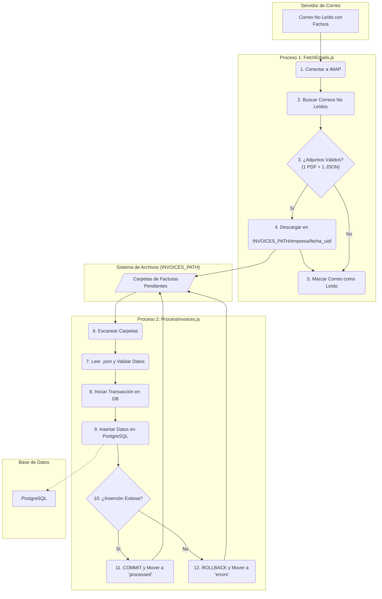

# MailProcessor: Sistema de Procesamiento Automatizado de Facturas

## Resumen del Proyecto

MailProcessor es un sistema de backend diseñado para automatizar por completo el ciclo de vida de las facturas recibidas por correo electrónico. El sistema monitorea una cuenta de correo, extrae y clasifica los documentos adjuntos (PDF y JSON), procesa los datos y los almacena de forma segura y transaccional en una base de datos PostgreSQL.

Este proyecto elimina la necesidad de entrada de datos manual, reduce errores y asegura la integridad de la información financiera mediante un sistema robusto de manejo de errores con rollbacks automáticos.

## Visualización del Proceso

El sistema se compone de dos micro-servicios independientes que se comunican a través del sistema de archivos, asegurando un desacoplamiento completo.



## Características Principales

*   **Conexión Segura a IMAP:** Utiliza credenciales de entorno para conectarse de forma segura a cualquier servidor de correo compatible con IMAP.
*   **Clasificación Automática:** Organiza las facturas en una estructura de carpetas lógica basada en la empresa emisora, extraída del correo.
*   **Procesamiento Transaccional:** Garantiza la atomicidad de los datos. O toda la información de la factura se guarda correctamente, o no se guarda nada, evitando datos corruptos.
*   **Manejo de Errores Robusto:** Las facturas que fallan durante el procesamiento se aíslan automáticamente en una carpeta `errors` para su revisión manual, sin detener el resto del sistema.
*   **Idempotencia:** Los correos se marcan como leídos para asegurar que no se procesen múltiples veces.
*   **Configuración Centralizada:** Toda la configuración del sistema se gestiona a través de variables de entorno, siguiendo las mejores prácticas de 12-Factor App.

## Tecnologías Utilizadas

*   **Lenguaje:** Node.js
*   **Gestor de Paquetes:** PNPM
*   **Base de Datos:** PostgreSQL
*   **Librerías Clave:** `node-imap`, `pg` (node-postgres)

## Desafíos Técnicos y Aprendizajes

Durante este proyecto, enfrenté varios desafíos interesantes:

*   **Gestión de Transacciones en la Base de Datos:** Implementar el `BEGIN`, `COMMIT` y `ROLLBACK` de forma correcta fue crucial. Aprendí a estructurar el código para que cualquier fallo en la cadena de inserciones (ej: un `item` de la factura) revirtiera la operación completa, manteniendo la base de datos siempre consistente.
*   **Manejo de Procesos Asíncronos:** Tanto la descarga de correos como el procesamiento de archivos son operaciones asíncronas. Utilicé `async/await` de manera extensiva para manejar el flujo de control de forma limpia y legible, especialmente en el manejo de errores dentro de los bucles de procesamiento.
*   **Seguridad de Credenciales:** Para evitar exponer datos sensibles en el código, toda la configuración, incluyendo contraseñas de la base de datos y del correo, se gestiona a través de variables de entorno (`.env`), una práctica estándar para la seguridad en aplicaciones.

## Estructura de Archivos Generada

El sistema gestiona las facturas moviéndolas a través de diferentes estados representados por la estructura de carpetas:

**1. Después de la descarga:**
```
/invoices_path/
└───<nombre_empresa>/
    └───<fecha_uid_factura>/
        ├─── factura.json
        └─── factura.pdf
```

**2. Después del procesamiento:**
```
/invoices_path/
└───<nombre_empresa>/
    ├───processed/
    │   └───<fecha_uid_factura_ok>/
    │       ├─── factura.json
    │       └─── factura.pdf
    │
    └───errors/
        └───<fecha_uid_factura_error>/
            ├─── factura.json
            └─── factura.pdf
```

## Nota sobre el Código Fuente

Por políticas de confidencialidad, el código de este proyecto no es público ya que fue desarrollado durante una pasantía.
